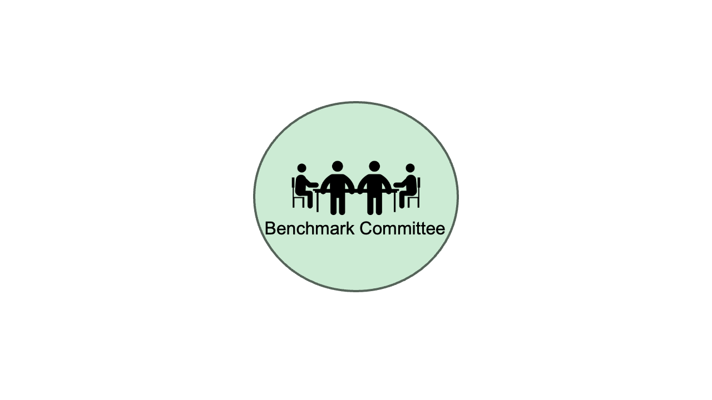
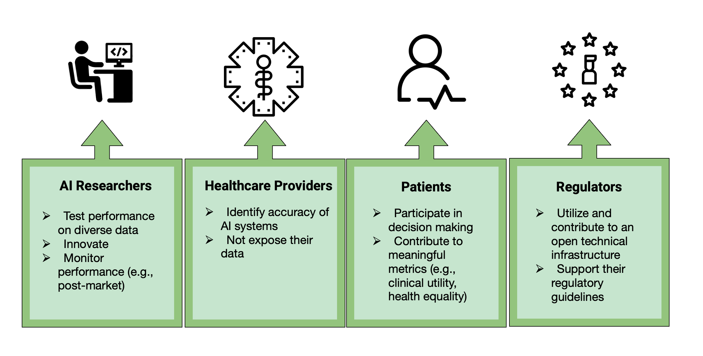

MedPerf is an open-source framework for benchmarking medical ML models prioritizing patient privacy to mitigate legal and regulatory risks. It uses *Federated Evaluation* in which medical ML models are securely distributed to multiple global facilities for evaluation. The goal of *Federated Evaluation* is to make it simple and reliable to share ML models with many data providers, evaluate those ML models against their data in controlled settings, then aggregate and analyze the findings.

The MedPerf approach empowers healthcare stakeholders through neutral governance to assess and verify the performance of ML models in an efficient and human-supervised process without sharing any patient data across facilities during the process.

|  | 
|:--:| 
| *Federated evaluation of medical AI model using MedPerf on a hypothetical example* |

## Why MedPerf?

MedPerf aims to identify bias and generalizability issues of medical ML models by evaluating them on diverse medical data across the world. On one hand this process can allow ML developers to quickly identify performance and reliability problems with their models and on the other hand healthcare stakeholders can validate such models for clinical efficacy.

Importantly, MedPerf supports technology for **neutral governance** in order to enable **full trust** and **transparency** among participating parties (e.g., ML vendor, data provider, regulatory authority)

|  | 
|:--:| 
| *Benchmark committee in MedPerf* |

## Benefits to healthcare stakeholders

Anyone who joins our platform can get several benefits, regardless of the role they will assume.

|  | 
|:--:| 
| *Benefits to healthacare stakeholders using MedPerf* |

<!-- ## What is a benchmark in the MedPerf perspective?

A benchmark is a collection of assets used by the platform to test the performance of ML models for a specific clinical problem. The primary components of a benchmark are:

1. **Specifications**: precise definition of the clinical setting (e.g., problem or task and specific patient population) on which trained ML models are to be evaluated. It also includes the labeling (annotation) methodology as well as the choice of evaluation metrics.
2. **Dataset Preparation**: a process that prepares datasets for use in evaluation, and can also test the prepared datasets for quality and compatibility. This is implemented as an MLCube (see [Data Preparator MLCube](mlcubes/mlcubes.md#data-preparator-mlcube)).
3. **Registered Datasets**: a list of registered datasets prepared according to the benchmark criteria and approved for evaluation use by their owners (e.g. patient data from multiple facilities representing (as a whole) a diverse patient population).
4. **Evaluation**: a consistent implementation of the testing pipelines and evaluation metrics.
5. **Reference Implementation**: a detailed example of a benchmark submission consisting of example model code, the evaluation component, and de-identified or synthetic publicly available sample data.
6. **Registered Models**: a list of registered models to run in this benchmark.
7. **Documentation**: documents for understanding and using the benchmark. -->
